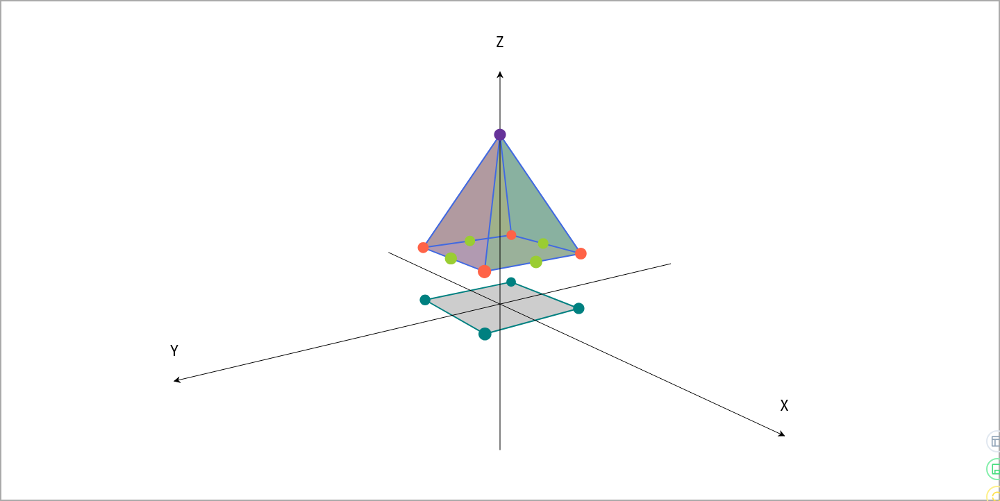
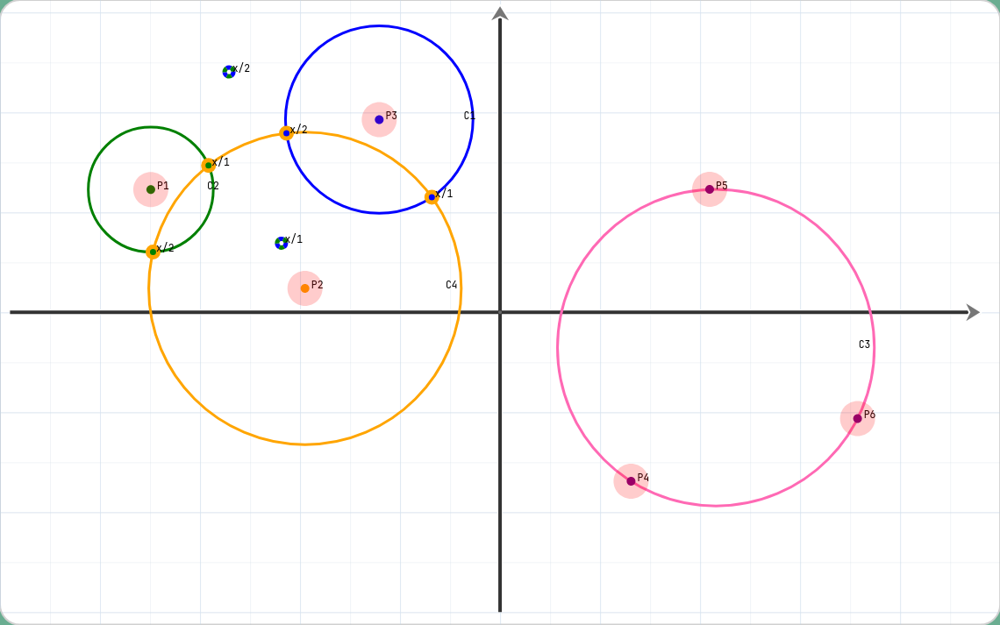

# Galixir

[](https://hex.pm/packages/galixir)

Geometric Algebra implementation in Elixir.

A concrete algebra can be generated via macro:

```ex
defmodule Example.PGA3 do
  # e1 squares to 1
  # e2 squares to 1
  # e3 squares to 1
  # e0 squares to 0
  use Galixir.GeometricAlgebra,
    signature: {1, 1, 1, 0},
    bases: {1, 2, 3, 0}

  # ... additional custom functions ...
end
```

`PGA3` is already defined in [`Galixir.Algebras.PGA3`](./lib/galixir/algebras/pga3.ex).

Then the `PGA3` module can be used to to calculations inside of the generated algebra:

```elixir
defmodule Example do
  import Galixir.Algebras.PGA3

  def align(ps, qs) do
    # https://observablehq.com/@enkimute/glu-lookat-in-3d-pga
    initial_m = one = new(scalar: 1)
    initial_q = dual(new(scalar: 1))

    Enum.zip_reduce(ps, qs, {initial_m, initial_q}, fn p, q, {m, prev_q} ->
      p = prev_q |> join(transform(m, p)) |> normalize() |> inverse()
      new_q = prev_q |> join(q)
      new_m = normalize(new_q) |> gp(p) |> add(one) |> normalize() |> gp(m)

      {new_m, new_q}
    end)
    |> elem(0)
  end

  def look_at(
        position \\ point(0, 10, 0),
        target \\ point(0, 0, 0),
        pole \\ ideal_point(0, 0, 1)
      ) do
    align(
      [position, target, pole],
      [point(0, 0, 0), point(0, 0, 1), ideal_point(0, 1, 0)]
    )
  end
end

eye = Galixir.Algebras.PGA3.point(3, 2, 1)
target = Galixir.Algebras.PGA3.point(0, 1, 0)
pole = Galixir.Algebras.PGA3.ideal_point(0, 0, 1)

camera_transform = Example.look_at(eye, target, pole)

point_in_world = Galixir.Algebras.PGA3.point(6, 5, 4)
point_in_screen = {sx,sy,sz} = Galixir.Algebras.PGA3.transform(camera_transform, point_in_world)
  |> Galixir.Algebras.PGA3.point_coordinates()
fov = 2
projected = {sx / sz * fov, sy / sz * fov}
```

## Installation

```elixir
def deps do
  [
    {:galixir, "~> 0.11.0"}
  ]
end
```

This library is currently experimental, documentation is still missing. Contributions are welcome.

## Example

[This Livebook](./guides/example.livemd) shows an example of how to used 3D Projective Geometric Algebra (PGA3) to render a 3D scene as SVG.

## 3d Projective Geometric Algebra



# 2d Conformal Geometric Algebra


